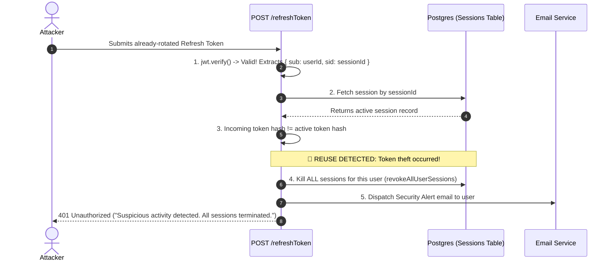
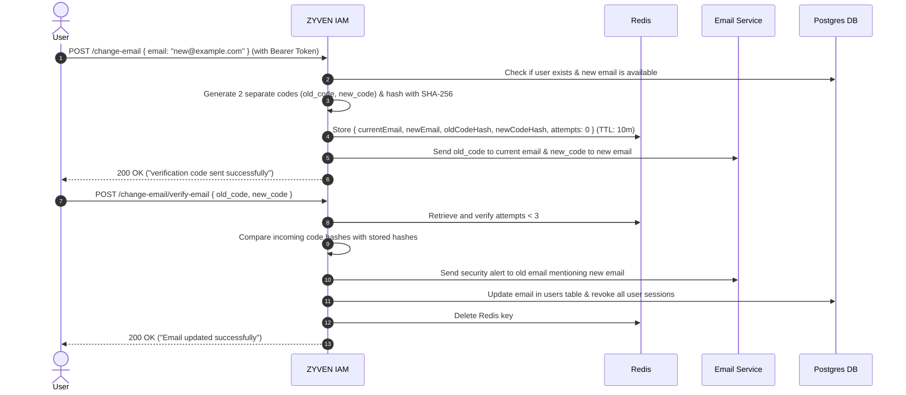

# 🛡️  Z.Y.V.E.N : Zero-trust Identity & Verification Engine(IAM Engine)


A modular, enterprise-grade **Identity & Access Management (IAM) Engine** and Auth Microservice designed for plug-and-play integration into distributed microservices and modern web/mobile applications. Built with **Node.js, Express, PostgreSQL, Redis, JWT, and OAuth 2.0**.

---

## 📑 Table of Contents

- [Vision & Architecture](#-vision--architecture)
- [Key Features & Implemented Capabilities](#-key-features--implemented-capabilities)
- [Security Highlights & Defenses](#-security-highlights--defenses)
  - [1. Refresh Token Reuse Detection & Automated Breach Invalidation](#1-refresh-token-reuse-detection--automated-breach-invalidation)
  - [2. Dual-Channel Email Verification](#2-dual-channel-email-verification)
  - [3. Multi-Tiered Atomic Rate Limiter with Fail-Open Resilience](#3-multi-tiered-atomic-rate-limiter-with-fail-open-resilience)
  - [4. Anti-User Enumeration Hardening](#4-anti-user-enumeration-hardening)
- [Plug-and-Play Integration Modes](#-plug-and-play-integration-modes)
- [API Route Map](#-api-route-map)
- [Database Schema](#-database-schema)
- [Development Roadmap](#-development-roadmap)
- [Environment Configuration](#-environment-configuration)
- [Project Structure](#-project-structure)
- [Author](#-author)

---

## 🏛️ Vision & Architecture

Sentinel IAM operates as a centralized identity engine that normalizes authentication across different identity providers into a single, unified application session:

```
                            ZYVEN IAM ENGINE
                                     │
         ┌───────────────────────────┼───────────────────────────┐
         ▼                           ▼                           ▼
  Email / Password              OAuth 2.0 (Google)        TOTP 2FA / Passkeys (Planned)
         │                           │                           │
         └───────────────────────────┼───────────────────────────┘
                                     │
                                     ▼
                             Unified Local User
                                     │
                                     ▼
                         Session Management Engine
                                     │
         ┌───────────────────────────┼───────────────────────────┐
         ▼                           ▼                           ▼
    Stateless JWTs              Redis Cache               PostgreSQL DB
  (Access / Claims)       (States, Rate Limits, TTL)    (Users, Hashed Sessions)
```

---

## 🌟 Key Features & Implemented Capabilities

### 🟢 Completed & Fully Active
- **Standard Authentication:** Email/password registration, secure verification token generation, resend verification workflows.
- **Stateless & Stateful Hybrid Sessions:** Short-lived access JWTs (`sub`, `sid`, `jti`, `aud`, `iss`) + stateful, hashed refresh tokens stored in PostgreSQL.
- **Refresh Token Rotation (RTR):** Automatic one-time token replacement on every token refresh cycle.
- **Refresh Token Reuse Detection (Breach Notification):** Cryptographically detects stolen/replayed tokens, terminates all active sessions for the user account, and dispatches a security alert email.
- **Dual-Channel Email Change:** Dual 6-byte hex verification codes (one to old email, one to new email), SHA-256 hashed in Redis (10m TTL) with an automatic **3-attempt brute-force lockout** and security notification alert.
- **Password Lifecycle:** Authenticated password reset, forgot-password token flow, and reset verification with full session invalidation upon changes.
- **Google OAuth 2.0 & Account Linking:** Complete Authorization Code Flow with CSRF `state` validation and dedicated account-linking capabilities for logged-in users.
- **Resilient Rate Limiting:** Atomic Redis Lua scripting with local in-memory fallback and fail-open guarantees.
- **Anti-Enumeration Protection:** Constant-time authentication comparisons and unified `"Invalid email or password"` responses across login endpoints.
- **Device & Geolocation Context:** Automatic parsing of client User-Agent (`browser`, `os`, `deviceName`) and IP tracking stored per active session.

### 🟡 In Progress / Upcoming (Route Blueprints Added)
- **Session Lifecycle APIs:** `POST /logout`, `POST /logout/all-devices`, `POST /logout/device/:sessionId`, `GET /sessions`, `GET /me`.
- **Two-Factor Authentication (2FA / TOTP):** Authenticator app pairing (Google Authenticator/Authy), Base32 secrets, QR codes, and backup recovery codes.
- **Passwordless / Magic Link:** Single-use cryptographic email login tokens.
- **Passkeys & WebAuthn:** FIDO2 biometric authentication (TouchID, FaceID, Windows Hello).
- **Workspace / Team Invitations:** Cryptographic invitation tokens for multi-tenant onboarding.
- **Adaptive Risk Engine:** Anomaly scoring evaluating Impossible Travel, IP reputation, and new device detection to dynamically trigger step-up MFA.

---

## 🛡️ Security Highlights & Defenses

### 1. Refresh Token Reuse Detection & Automated Breach Invalidation
When an attacker steals an old refresh token and attempts to replay it:
1. ZYVEN decodes the token's signed `sid` (Session ID) and `sub` (User ID).
2. It fetches the session from PostgreSQL and compares the active `refresh_token_hash` against the incoming token hash.
3. If mismatched, it recognizes a token replay attack, **instantly kills all active sessions across all devices for that user**, and sends an emergency breach notification email.



---

### 2. Dual-Channel Email Verification
Prevents account takeovers (ATO) during primary email modifications:
- Generates two distinct verification codes (`old_code` and `new_code`).
- Hashes both using SHA-256 and caches them under `email:change:<userId>` in Redis for 10 minutes.
- Enforces a **3-attempt brute-force limit** in Redis before destroying the session.
- Dispatches a security notification to the old email address with details of the new email address.



---

### 3. Multi-Tiered Atomic Rate Limiter with Fail-Open Resilience
1. **Tier 1 (Primary - Redis Lua):** Executes an atomic `INCR` + `EXPIRE` script inside Redis in a single network roundtrip.
2. **Tier 2 (Secondary - In-Memory RAM):** Fails over to a local process-level JavaScript `Map()` if Redis network connection drops.
3. **Tier 3 (Tertiary - Fail-Open):** If both fail, logs the event and proceeds so infrastructure drops never block legitimate users.

---

### 4. Anti-User Enumeration Hardening
- Login and reset endpoints use unified error messaging: `"Invalid email or password"`.
- Password verification utilizes constant-time bcrypt verification.

---

## 🔌 Plug-and-Play Integration Modes

Sentinel IAM is engineered to be used in two modes:

### Mode 1: Centralized Auth Microservice (Recommended)
Run ZYVEN IAM on a dedicated domain (e.g., `https://auth.yourdomain.com`).
- Other internal microservices (E-commerce, Billing, Dashboard) verify the user's JWT without touching the authentication database.

### Mode 2: Modular Express Engine
Mount the router into any existing Node.js / Express monolith:
```javascript
import express from "express";
import authRoutes from "./routers/auth/auth.route.js";

const app = express();
app.use(express.json());

// Mount the IAM Engine
app.use("/api/v1/auth", authRoutes);
```

---

## 🗺️ API Route Map

### 🟢 Active Core Endpoints
| Method | Endpoint | Description | Protection |
| :--- | :--- | :--- | :--- |
| `POST` | `/register` | Register new user account | Rate Limited + Zod |
| `GET` | `/verify` | Verify email token | Public |
| `POST` | `/resend-verification` | Resend verification email | Rate Limited |
| `POST` | `/login` | Authenticate user & issue tokens | Rate Limited + Zod |
| `POST` | `/refreshToken` | Rotate refresh token with reuse guard | Rate Limited + Zod |
| `GET` | `/google` | Generate Google OAuth login URL | Public |
| `GET` | `/google/callback` | Handle Google OAuth callback | State Validated |
| `GET` | `/google/link` | Generate Google account-linking URL | JWT Authenticated |
| `GET` | `/google/link/callback` | Complete Google account linking | State Validated |
| `POST` | `/password-reset` | Update password for authenticated user | JWT Authenticated |
| `POST` | `/forgot-password` | Request password reset email | Rate Limited |
| `POST` | `/reset-password` | Complete password reset via token | Rate Limited |
| `POST` | `/change-email` | Request dual-code email change | JWT Authenticated |
| `POST` | `/change-email/verify-email`| Verify dual codes & update email | JWT Authenticated |

### 🟡 Blueprint Endpoints (Commented in `auth.route.js`)
| Method | Endpoint | Description | Target Flow |
| :--- | :--- | :--- | :--- |
| `POST` | `/logout` | Revoke current session & clear cookie | Session Management |
| `POST` | `/logout/all-devices` | Revoke all active sessions | Session Management |
| `POST` | `/logout/device/:sessionId` | Revoke specific device session | Session Management |
| `GET` | `/sessions` | List all active logins & device metadata | Session Management |
| `GET` | `/me` | Get current authenticated user profile | User Profile |
| `POST` | `/two-fa/setup` | Generate TOTP secret & QR code | 2FA / Authenticator |
| `POST` | `/two-fa/enable` | Confirm OTP & enable 2FA | 2FA / Authenticator |
| `POST` | `/two-fa/verify` | Verify 2FA OTP during step-up login | 2FA / Authenticator |
| `POST` | `/two-fa/disable` | Disable 2FA with password/OTP check | 2FA / Authenticator |
| `POST` | `/passwordless/send-link`| Send magic login link to email | Passwordless |
| `GET` | `/passwordless/verify` | Verify magic link token & issue JWT | Passwordless |
| `POST` | `/passkey/register/options`| Get WebAuthn registration options | Passkeys / FIDO2 |
| `POST` | `/passkey/register/verify` | Verify WebAuthn registration | Passkeys / FIDO2 |
| `POST` | `/invite-register` | Register user via invitation token | Team Onboarding |
| `DELETE`| `/account` | Delete user account & scrub sessions | GDPR / Lifecycle |

---

## 🗄️ Database Schema

```sql
-- Users Table
CREATE TABLE users (
    id UUID PRIMARY KEY DEFAULT gen_random_uuid(),
    name VARCHAR(255) NOT NULL,
    email VARCHAR(255) UNIQUE NOT NULL,
    password VARCHAR(255),
    google_id VARCHAR(255) UNIQUE,
    is_verified BOOLEAN DEFAULT FALSE,
    verification_token VARCHAR(255),
    verification_token_expires TIMESTAMP,
    reset_token VARCHAR(255),
    reset_token_expires TIMESTAMP,
    two_fa_enabled BOOLEAN DEFAULT FALSE,
    two_fa_secret VARCHAR(255),
    created_at TIMESTAMP DEFAULT CURRENT_TIMESTAMP,
    updated_at TIMESTAMP DEFAULT CURRENT_TIMESTAMP
);

-- Sessions Table (Stateful Device Tracking)
CREATE TABLE sessions (
    session_id UUID PRIMARY KEY DEFAULT gen_random_uuid(),
    user_id UUID REFERENCES users(id) ON DELETE CASCADE,
    refresh_token_hash VARCHAR(255) NOT NULL,
    device_id VARCHAR(255),
    device_name VARCHAR(255),
    ip_address VARCHAR(45),
    user_agent TEXT,
    last_active TIMESTAMP DEFAULT CURRENT_TIMESTAMP,
    revoked_at TIMESTAMP,
    expires_at TIMESTAMP NOT NULL,
    created_at TIMESTAMP DEFAULT CURRENT_TIMESTAMP,
    updated_at TIMESTAMP DEFAULT CURRENT_TIMESTAMP
);
```

---

## 🗺️ Development Roadmap

- [x] **Phase 1:** Core Authentication & Verification (Bcrypt, JWT, Postgres)
- [x] **Phase 2:** Resilient Infrastructure (Redis Lua Rate Limiting, Fail-open)
- [x] **Phase 3:** Google OAuth 2.0 & Account Linking
- [x] **Phase 4:** Dual-Channel Email Update with Brute-Force Protection
- [x] **Phase 5:** Cryptographic Refresh Token Reuse Detection & Breach Containment
- [ ] **Phase 6:** Session Management APIs (`/logout`, `/all-devices`, `/sessions`, `/me`)
- [ ] **Phase 7:** Two-Factor Authentication (TOTP / Google Authenticator) & Recovery Codes
- [ ] **Phase 8:** Passwordless Magic Link Login
- [ ] **Phase 9:** Passkeys / WebAuthn (FIDO2 Biometric Login)
- [ ] **Phase 10:** Adaptive Risk Engine (Impossible Travel, Geo-Anomalies, Dynamic MFA)

---

## ⚙️ Environment Configuration

Create a `.env` file in the root directory:

```env
PORT=8000
NODE_ENV=development

# PostgreSQL Database
DB_HOST=localhost
DB_PORT=5432
DB_NAME=auth_practice
DB_USER=postgres
DB_PASSWORD=your_postgres_password

# Redis Cache
REDIS_HOST=localhost
REDIS_PORT=6379
REDIS_PASSWORD=

# JWT Secrets & Configuration
JWT_ACCESS_SECRET=your_super_secret_access_key
JWT_REFRESH_SECRET=your_super_secret_refresh_key
JWT_ALGORITHM=HS256
JWT_ISSUER=sentinel-iam-engine
JWT_AUDIENCE=sentinel-clients
JWT_ACCESS_EXPIRES_IN=15m
JWT_REFRESH_EXPIRES_IN=7d

# Google OAuth 2.0
GOOGLE_CLIENT_ID=your_google_client_id.apps.googleusercontent.com
GOOGLE_CLIENT_SECRET=your_google_client_secret
GOOGLE_REDIRECT_URI=http://localhost:8000/api/v1/auth/google/callback
GOOGLE_LINK_REDIRECT_URI=http://localhost:8000/api/v1/auth/google/link/callback

# SMTP Email Configuration
SMTP_HOST=smtp.gmail.com
SMTP_PORT=587
SMTP_USER=your_email@gmail.com
SMTP_PASSWORD=your_email_app_password
```

---

## 📂 Project Structure

```
src/
├── config/             # Database, Redis, JWT, Logger, Email configs
├── constants/          # HTTP status codes & default system constants
├── controller/         # Request handling & HTTP response mapping
├── middlewares/        # Authentication, Rate Limiting, Zod Validation
├── models/             # Database model definitions
├── repos/              # PostgreSQL data access layer (User, Session)
├── routers/            # Express endpoint routing
├── services/           # Core business logic (Auth, Email, Google, Token, Redis)
├── utils/              # Password hashing, token generators, response formatters
├── validators/         # Zod schemas for input validation
├── app.js              # Express app setup & middleware pipeline
└── server.js           # Server entry point
```

---

## 👨‍💻 Author

**Aryan Singh**
- Specialized in Backend Engineering, Distributed Identity Architecture, and Application Security.